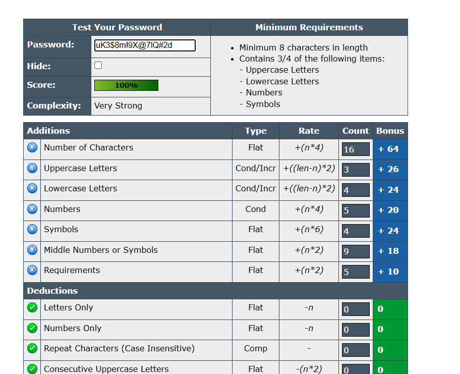

# 🎉 Cybersecurity Internship — Task 6  
**Author:** Om Kalyankar  
**📅 Date:** 12th August 2025  

---

## 🛡️ Task Title  
**Create a Strong Password and Evaluate its Strength**  

---

## 🎯 Objective  
The goal of this task is to understand the characteristics that make a password strong and evaluate its strength using various online password strength checkers.  

---

## ⚙️ Process  

### **1. Tools Used**
- [🔗 Password Meter](https://www.passwordmeter.com/)  
- [🔗 NordPass Password Strength Checker](https://nordpass.com/password-strength-checker/)  
- [🔗 Kaspersky Password Checker](https://password.kaspersky.com/)  

---

### **2. Password Samples Tested**

| 🔑 Password | 📝 Description |
| --- | --- |
| `12345678` | Common, numeric only |
| `P@ssword` | Common word with one symbol |
| `MyD0g$N@meIsB1ngo!` | Long, complex with substitutions |
| `qwertyuiop` | Keyboard pattern |
| `Tr0ub4dor&3` | Based on a popular XKCD comic example |
| `uK3$8m!9X@7lQ#2d` | Randomly generated secure password — **example in screenshot** |

---

### **3. Evaluation — Password Meter Results**

| 🔑 Password | 📊 Score (%) | 🛡️ Strength | 💬 Comments |
| --- | --- | --- | --- |
| `12345678` | 4% | Very Weak | Too short, numeric only |
| `P@ssword` | 54% | Weak | Predictable pattern |
| `MyD0g$N@meIsB1ngo!` | 100% | Very Strong | High complexity and length |
| `qwertyuiop` | 22% | Very Weak | Pattern-based, easy to guess |
| `Tr0ub4dor&3` | 74% | Strong | Good mix but partially predictable |
| `uK3$8m!9X@7lQ#2d` | 100% | Very Strong | 16 chars, mix of uppercase, lowercase, numbers, and symbols |

---

### **4. Screenshot Example — Strong Password Test Result**  

Below is the Password Meter analysis for the strongest tested password `uK3$8m!9X@7lQ#2d`:

**Key Details from Screenshot:**  
- **Length:** 16 characters  
- **Uppercase Letters:** 3  
- **Lowercase Letters:** 4  
- **Numbers:** 5  
- **Symbols:** 4  
- **Middle Numbers/Symbols:** 9  
- **Score:** 100%  
- **Complexity:** Very Strong  
- **No deductions:** No repeated characters, no letter-only or number-only patterns  

---

## 🧠 Analysis  

### 🔍 What Makes a Password Strong?  
A strong password generally includes:  
- **Length:** Minimum 12 characters (longer is better)  
- **Character Variety:** Uppercase, lowercase, numbers, and special characters  
- **Unpredictability:** No common words, personal info, or repeated sequences  
- **Randomness:** Generated by a password manager or passphrase generator  

---

### ⚠️ Common Weak Password Pitfalls  
- Short passwords  
- Common sequences (`123456`, `abcdef`)  
- Simple leetspeak (`P@ssword`) without randomness  
- Keyboard patterns (`asdfgh`, `qwerty`)  

---

## ✅ Recommendations  
- Use **passphrases** (e.g., `B1gC@tJumps0ver2Moon!`) — easy to remember, hard to crack  
- Consider **password managers** for generating and storing credentials  
- Never reuse passwords across different accounts  
- Always enable **two-factor authentication (2FA)** for extra security  

---

## 🎯 Conclusion  
Through this exercise, it’s clear that **length, complexity, unpredictability, and randomness** are the main factors for creating a strong password. Using a password manager and enabling 2FA significantly improves account security.

---
